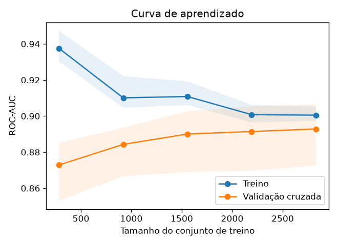
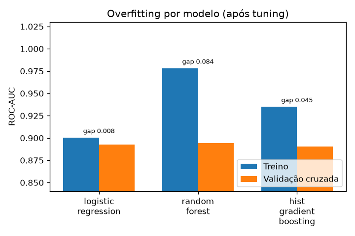
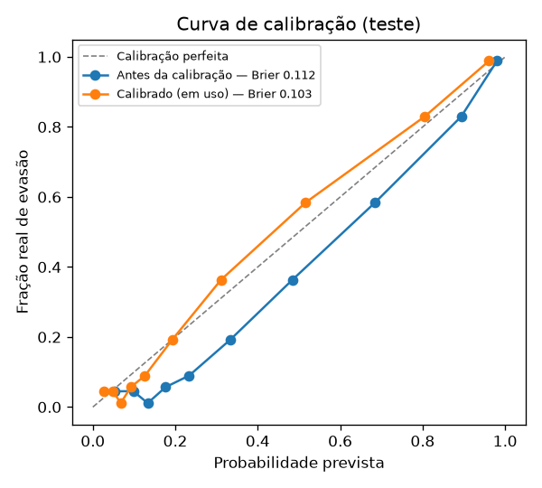

# Análise e conclusões — Previsão de Evasão Estudantil

Documento de apoio ao vídeo e à banca. Resume dados, metodologia, resultados e a
análise de over/underfitting. Decisões de arquitetura estão em [`docs/adr/`](adr/).
Todos os números vêm de `models/metrics.json` (gerado por `python -m src.train`).

## 1. Dados

- **4.424 estudantes × 28 variáveis** (UCI *Predict Students' Dropout and Academic
  Success*, traduzido para PT). Sem valores ausentes; 1 duplicata removida.
- Alvo binarizado: `Desistente` (1) vs resto (0) — taxa de evasão ≈ **32%**
  ([ADR 0001](adr/0001-binary-target-framing.md)).

### Sinal preditivo (EDA)

| Fator | Taxa de evasão |
|---|---|
| Devedor = sim | **62%** vs 28% (não) |
| Mensalidades atrasadas | **87%** vs 25% (em dia) |
| Bolsista = sim | 12% vs 39% (não) |
| Gênero masculino | 45% vs 25% (feminino) |

Nota média do 1º semestre (após reparo): **7,3** (evasão) vs **12,6** (formados).

### Qualidade dos dados — reparo das notas

~40% dos valores das duas colunas de nota estavam corrompidos por deslocamento do
ponto decimal. A regra "dividir por 10 até [0, 20]" recupera 100% dos valores sem
ambiguidade ([ADR 0002](adr/0002-grade-repair-strategy.md)). Sem o reparo, a nota
— que separa bem os desfechos na análise univariada (7,3 vs 12,6) — entraria no
modelo com valores sem sentido. No modelo final, porém, o peso da nota é pequeno: a
mesma informação já aparece nas contagens de disciplinas aprovadas (seção 9).

## 2. Momento da previsão — por que o modelo principal é *early-warning*

O alvo é saber **quem vai evadir a tempo de intervir**. As variáveis do 2º semestre
trazem uma informação que, na prática, já descreve a evasão: dos **869 alunos com 0
disciplinas aprovadas no 2º semestre, 84% evadiram** (contra 20% dos demais).

Por isso foram treinadas duas variantes, com o mesmo protocolo e os mesmos alunos
de treino/teste ([ADR 0006](adr/0006-early-warning-primary-model.md)):

| Variante | Dados usados | Momento da previsão | Papel |
|---|---|---|---|
| `early_warning` | ingresso + 1º semestre | fim do 1º semestre | **modelo em uso** (app) |
| `full` | ingresso + 1º e 2º semestres | fim do 2º semestre | teto de desempenho |

Uma variante só com dados de ingresso (sem nenhum semestre) também foi medida durante
a análise: ROC-AUC de teste ≈ 0,82 — cedo demais para ser útil sozinha.

## 3. Feature engineering

- **Reparo de notas** (`GradeRepairTransformer`).
- **Features derivadas** (por semestre disponível na variante): taxa de aprovação
  (aprovadas / inscritas) e taxa de avaliação (avaliações / inscritas). A variante
  `full` acrescenta variação de nota entre semestres e totais dos dois semestres.
- **Categóricos** (`Curso`, `QualificacaoAnterior`): one-hot (`handle_unknown="ignore"`).
- **Numéricos**: `StandardScaler`. Binários: passados direto.
- **Fora do modelo**: gênero, nacionalidade e estado civil
  ([ADR 0007](adr/0007-sensitive-attributes.md)).
- Tudo em um único `Pipeline`/`ColumnTransformer` → mesmo processamento no treino e
  no app, sem *train/serving skew*. Testes automatizados garantem que nenhuma coluna
  do 2º semestre e nenhum atributo sensível chegam ao modelo principal.

## 4. Modelagem (modelo principal)

Os três candidatos são **tunados** com `RandomizedSearchCV` (`StratifiedKFold`,
5 folds, ROC-AUC) e comparados após o tuning:

| Modelo | CV ROC-AUC (média ± desvio) | ROC-AUC de treino | Gap treino–CV |
|---|---|---|---|
| **Regressão Logística** (escolhida) | 0.893 ± 0.012 | 0.901 | **0.008** |
| Random Forest | 0.894 ± 0.008 | 0.978 | 0.084 |
| HistGradientBoosting | 0.891 ± 0.009 | 0.935 | 0.045 |

A seleção usa a **regra de um erro padrão**: entre os modelos cuja CV fica a menos de
um erro padrão do melhor (tolerância 0.004), fica o mais simples. Regressão
Logística e Random Forest empatam; a Regressão Logística (`C ≈ 0.31`) foi escolhida
([ADR 0003](adr/0003-model-selection.md)).

**Probabilidades e threshold** ([ADR 0004](adr/0004-imbalance-and-threshold.md)):
`class_weight="balanced"` → **calibração** sigmoid (`CalibratedClassifierCV`) →
threshold de alerta escolhido para **recall ≥ 0.80** nas probabilidades calibradas
*out-of-fold* do treino → threshold ≈ **0.29**.

## 5. Resultados no conjunto de teste (n = 885)

| Métrica | **Principal** — fim do 1º sem. | Referência — fim do 2º sem. |
|---|---|---|
| ROC-AUC (IC 95% bootstrap) | **0.912** [0.887, 0.934] | 0.935 [0.914, 0.953] |
| PR-AUC | 0.866 | 0.899 |
| Recall (evasão) (IC 95%) | **0.838** [0.793, 0.878] | 0.835 [0.789, 0.879] |
| Precisão (evasão) | 0.730 | 0.798 |
| F1 (evasão) | 0.780 | 0.816 |
| Acurácia | 0.849 | 0.879 |
| Alertas a cada 100 alunos | 37 | 34 |

Matriz de confusão do modelo principal: TN=513, FP=88, FN=46, TP=238. Ao fim do 1º
semestre o modelo já identifica **~84% dos alunos que vão evadir**, e ~73% dos
alertas emitidos são de alunos que de fato evadem.

Com o mesmo recall-alvo, os dois modelos detectam a mesma fração das evasões; o custo
de avisar um semestre antes é um pouco mais de falsos alarmes (precisão 0.73 vs
0.80). Os intervalos de confiança de ROC-AUC se sobrepõem.

### Baselines (mesmo conjunto de teste)

| Abordagem | ROC-AUC | Recall | Precisão | F1 |
|---|---|---|---|---|
| Classificador aleatório (estratificado) | 0.50 | 0.32 | 0.32 | 0.32 |
| Regra: mensalidades atrasadas OU 0 aprovações no 1º sem. | 0.77 | 0.59 | 0.84 | 0.69 |
| **Modelo principal** | **0.91** | **0.84** | 0.73 | **0.78** |

A regra simples é precisa, mas deixa passar 41% das evasões; o modelo recupera
grande parte delas.

## 6. Análise de overfitting / underfitting

**Modelo principal** (Regressão Logística):

| Conjunto | ROC-AUC |
|---|---|
| Treino | 0.901 |
| Validação cruzada | 0.893 |
| Teste | 0.912 |

- **Gap treino–CV ≈ 0.008** → desprezível ⇒ **sem overfitting**.
- CV e teste **altos** (≈ 0.89–0.91) ⇒ **sem underfitting**.
- A **curva de aprendizado** confirma: a curva de treino cai de 0.937 (283 amostras)
  para 0.901 e a de validação sobe de 0.873 para 0.893, **convergindo** —
  comportamento clássico de modelo bem ajustado. Adicionar mais dados traria ganho
  marginal.
- O teste (0.912) fica um pouco acima da CV (0.893); a diferença está dentro do
  intervalo de confiança do teste e não indica problema.

**Contraste com os outros candidatos** (tabela da seção 4): a **Random Forest**
mostra **overfitting** claro — ROC-AUC de treino 0.978 contra 0.894 na CV (gap
0.084, sete vezes o desvio entre folds): ela memoriza o treino sem generalizar
melhor. O HistGradientBoosting fica no meio (gap 0.045). A regularização L2 da
Regressão Logística (`C ≈ 0.31`) mantém o modelo simples o bastante para generalizar.

## 7. Calibração

O `class_weight="balanced"` desloca as probabilidades para cima: antes da calibração,
a probabilidade média prevista no teste era **0.407** para uma taxa real de **0.321**
(Brier 0.112). Após a calibração sigmoid: **0.315** (Brier 0.103). Assim, "30%" no
app significa que cerca de 30 em cada 100 alunos com aquele perfil evadem.

## 8. Auditoria por gênero (fairness)

Gênero não é usado pelo modelo, mas é usado para auditá-lo
([ADR 0007](adr/0007-sensitive-attributes.md)):

| Gênero | n | Taxa real de evasão | Recall | Precisão | Taxa de alerta |
|---|---|---|---|---|---|
| Feminino | 563 | 0.24 | 0.825 | 0.681 | 0.29 |
| Masculino | 322 | 0.46 | 0.850 | 0.781 | 0.50 |

O recall é parecido entre os grupos (o modelo detecta mulheres e homens em risco em
proporções próximas). A diferença de precisão acompanha a diferença real nas taxas de
evasão.

## 9. Explicabilidade (SHAP e coeficientes)

- **Global** (`reports/figures/shap_summary.png` e `shap_importance_bar.png`): os
  fatores de maior peso são o **número de disciplinas aprovadas no 1º semestre**
  (mais aprovações → menos risco), o **número de disciplinas inscritas e creditadas**
  (com as aprovações fixas, mais inscrições significam mais reprovações → mais risco),
  **mensalidades em dia** (reduz o risco), a **taxa de aprovação do 1º semestre**
  (reduz) e ser **bolsista** (reduz). A nota média do 1º semestre tem peso pequeno no
  modelo final (32º de 50 fatores), pois sua informação já está nas contagens de
  aprovação.
- Como várias variáveis de desempenho são correlacionadas, cada coeficiente deve ser
  lido em conjunto com os demais, e não isoladamente.
- **Local**: o app explica cada previsão individual com os fatores que mais
  empurraram o aluno para risco alto ou baixo (`src/explain.explain_one`).

## 10. Limitações e trabalhos futuros

- **Evasão durante o 1º semestre**: parte dos alunos evade antes do momento da
  previsão; para eles, o alerta chega tarde. Uma variante só com dados de ingresso
  (ROC-AUC ≈ 0,82) poderia servir como triagem inicial.
- **Momento das variáveis financeiras**: `MensalidadesEmDia`, `Devedor` e `Bolsista`
  estão entre os fatores mais fortes. O artigo do dataset (Realinho et al., 2022) as
  agrupa como dados socioeconômicos da matrícula, mas não informa a data exata do
  registro; se alguma foi medida depois, pode carregar informação posterior ao
  momento da previsão.
- **`Matriculado` como negativo**: alunos ainda em curso podem evadir depois;
  simplificação assumida pelo framing ([ADR 0001](adr/0001-binary-target-framing.md)).
- **Generalização**: base de uma única instituição/período; recalibrar antes de
  aplicar em outro contexto.
